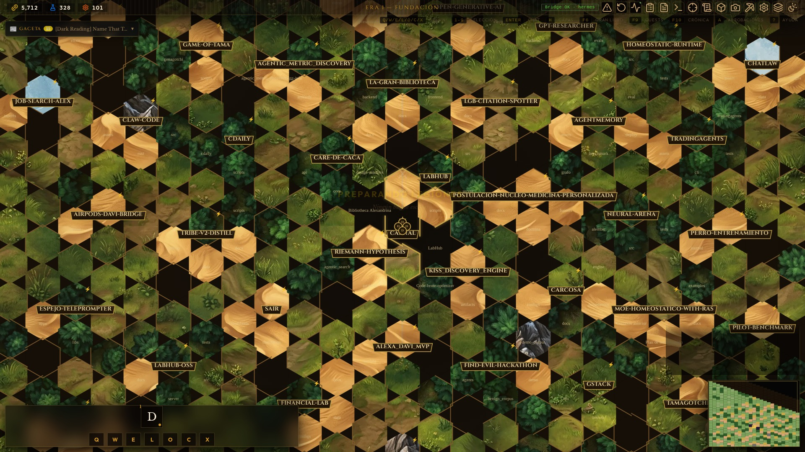
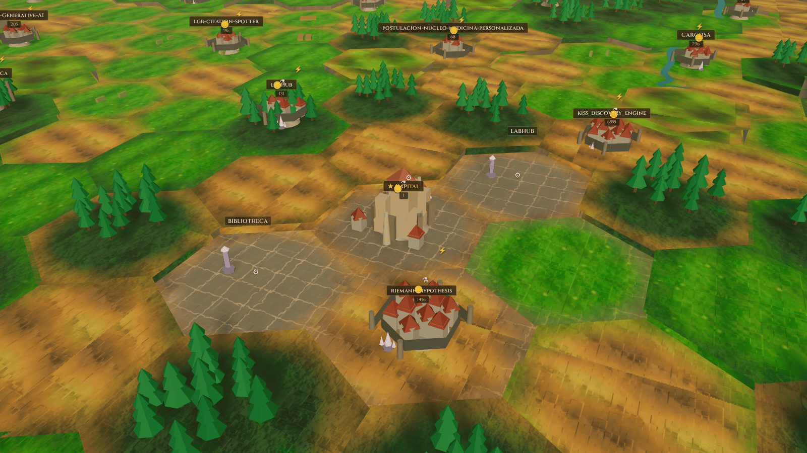
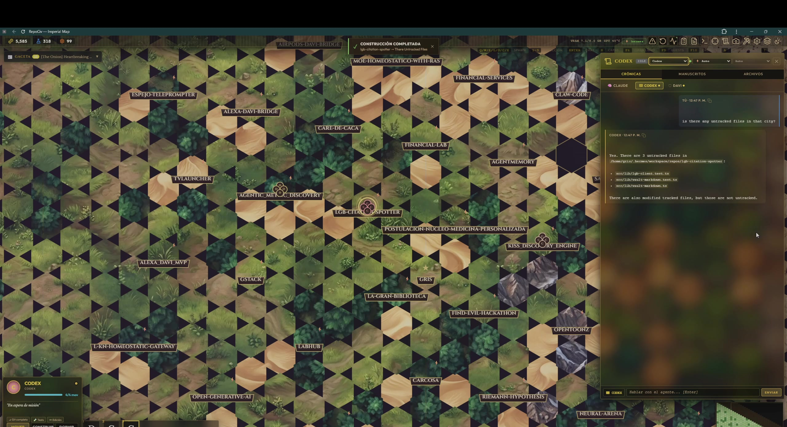

# RepoCiv — Imperial Agent Dashboard

> 🌐 **Languages:** [English](README.en.md) · [Español](README.md)

[](https://opensource.org/licenses/MIT)
[](https://github.com/Grizaceo/repociv/actions)
[](docs/ROADMAP.md)

> A hexagonal dashboard inspired by Civilization V that visualizes your repos folder as cities on a map, AI agents as units, and background processes as buildings.

**Stack:** TypeScript + Vite (Canvas 2D + WebGL/Three.js) · Python HTTP bridge · DuckDB/JSONL local ledger
**Compatible with:** [Hermes Agent](https://hermes-agent.nousresearch.com) (Nous Research) — drop-in in any existing setup

 | 
--- | ---
*Flat hexagonal map — classic, fast, feature-complete.* | *3D WebGL render (Three.js r175) — faceted low-poly Civ V pass: biomes, dense forests, walled cities, golden hour. Units spawn/despawn, cities grow by tier, fog of war transitions.*


*Click a city on the map, ask your agent what's there — the agent inspects the real repo and answers.*

---

## What is this?

RepoCiv turns your repos folder into an interactive map:

- Each **repo** is a **city** on the hexagonal map
- Each **AI agent** (Claude, Codex, your own LLM) is a **unit** that walks toward workbenches
- **Background processes** are buildings inside the city
- The **HTTP + WebSocket bridge** connects the map in real time with your agent runtime

It is single-user by design: a board for coordinating your own agent ecosystem, locally, with no cloud.

---

## Quick Start

### Option A — Docker (recommended for trying it out)

```bash
git clone https://github.com/Grizaceo/repociv.git
cd repociv
export MAP_ROOT="$HOME/projects"   # folder whose subdirs become cities
docker compose up --build
# Open http://localhost:5273
```

See [docs/DOCKER.md](docs/DOCKER.md) for full reference (port mapping, env vars, troubleshooting). The image runs the bridge + Vite in a single container — no Python or Node install needed on the host.

### Option B — Local install

### 1. Clone and install

```bash
git clone https://github.com/Grizaceo/repociv.git
cd repociv

# Frontend
npm install

# Backend
python3 -m venv .venv
source .venv/bin/activate
pip install -r requirements.txt

# Assets (mandatory before first run — not tracked in git)
npm run assets
npm run assets:3d
```

> **Mandatory assets.** PNG/WebP atlases and 3D textures are not versioned in git.
> After cloning, run `npm run assets` and `npm run assets:3d` before `npm run dev`
> or the map may render without terrain, props, or the isometric office view.

### 2. Configure

```bash
cp .env.example .env
# Edit .env if your repos folder is not in ~/.hermes/workspace/repos
# Key variable: REPOCIV_MAP_ROOT=~/your/repos/folder
```

### 3. Run

```bash
# Option A: two terminals
# Terminal 1 — Backend
python3 -m server.bridge

# Terminal 2 — Frontend
npm run dev
```

```bash
# Option B: tmux (single session)
./scripts/dev-start.sh --tmux
```

Open `http://localhost:5273`. You will see the **Imperial Map** with your repos as cities.

---

## Workspace configuration

RepoCiv looks for repos in this priority order. Defaults are **typical examples** (they assume a Hermes-style layout) — you can point them at any path on your system. The **onboarding** flow walks you through this on first run and lets you pick your own folders.

| Variable | Default | Function |
|---|---|---|
| `REPOCIV_MAP_ROOT` | — | Map root folder (direct children = cities) |
| `WORKSPACE_ROOT` | `~/.hermes/workspace/repos` | Alternative alias |
| `REPOCIV_REPOS_ROOT` | `~/.hermes/workspace/repos` | Fallback |

Example for a standard layout:

```bash
# .env
REPOCIV_MAP_ROOT=~/projects
```

---

## Architecture

```
┌─────────────────────────────────────────────┐
│  ThreeMapRenderer   (src/three/)*           │  ← WebGL 3D renderer (Three.js r175)
│  Canvas 2D Renderer (src/renderer.ts)        │  ← Flat 2D hex fallback
│  Minimap Renderer   (src/minimapRenderer.ts) │     minimap, units, cities
├─────────────────────────────────────────────┤
│  GameState  (src/game.ts)                   │  ← Simulation loop,
│  Priority Matrix (src/priorityMatrix.ts)     │     fatigue, mission queues,
│  Fatigue System  (src/fatigue.ts)            │     A* pathfinding
├─────────────────────────────────────────────┤
│  Bridge  (src/bridge.ts + server/bridge.py) │  ← HTTP/WebSocket → agent runtime
│  localMap.ts + localPathfinding.ts           │     Process scanner, task queue
└─────────────────────────────────────────────┘

*  \* 25+ modules: TerrainAtlas, HexWorldScene, CityProps3D, FogOfWar,
     UnitMesh3D, Rivers3D, SkyDome3D, ForestProps, MountainProps, etc.
```

### Macro view → Local view

```
[MACRO VIEW]                        [LOCAL VIEW — RimWorld style]
~/projects/                    →     Interior hexagonal grid
  └─ my-repo (city)                  Workbenches = files/folders
       ├─ src/                        Units = walking agents
       ├─ tests/                      Mission = go A → B → complete
       └─ ...
```

- **Macro:** hex map in 2D (default) or 3D WebGL — key `3` or toolbar button toggles `flat` ↔ `webgl`
- **Local:** double-click a city → interior isometric office view
  - **Workbenches** are files/folders prioritized by the Priority Matrix
  - **Units** walk toward workbenches with cached A* (≤300 hexes)
- `Esc` exits local view and returns to the macro map

---

## Agent integration

RepoCiv exposes an **HTTP + WebSocket bridge** that any agent can connect to:

```bash
# The bridge listens on localhost:5274 by default
# Main endpoints:
POST /commands                    # submit a command to the bus
GET  /agents                      # list active agents
GET  /pending                     # pending task queue
GET  /approvals                   # commands awaiting approval
POST /approvals/<id>/approve      # approve a pending command
POST /approvals/<id>/reject       # reject a pending command
```

See [docs/API.md](docs/API.md) for the full reference.

### MCP Server

RepoCiv is also exposed as an **MCP server over stdio** (`server/mcp_server.py`), letting Claude Code, Cursor or other clients operate the dashboard as external agents:

```json
{
  "mcpServers": {
    "repociv": {
      "command": "python",
      "args": ["/absolute-path/repociv/server/mcp_server.py"]
    }
  }
}
```

44 tools covering 15 domains with MCP tools: agents, commands, approvals, pending, context, GPU, wonders, graph-relations, foreign-relations and more. See [docs/MCP.md](docs/MCP.md).

---

## Priority Matrix

System that decides which file/folder is most urgent for each agent:

```
score = (ageWeight × ageScore)
      + (testWeight × hasTests ? 1 : 0)
      + (debtWeight × churnRisk)
      + (extWeight  × extensionScore)
      + (sizeWeight × sizeScore)
```

| Label | Condition |
|-------|-----------|
| `CRIT` | score ≥ 70 |
| `HIGH` | score ≥ 50 |
| `NORM` | score ≥ 30 |
| `LOW`  | score < 30 |

Press `P` to open the Priority Panel. API: `computePriorityScore(fileNode, weights)` in `src/priorityMatrix.ts`.

---

## Fatigue System

Units have XCOM-style fatigue: working drains them, resting in a RestArea restores them.

```
effectiveSpeed = currentFatigue / maxFatigue   (0.0 → 1.0)
```

Thresholds configurable in the `Settings Panel` (`F11`) or in `src/gameConfig.ts`.

---

## News gazette

Every system action (mission completed, approval requested, agent entering or leaving, error, info) is recorded as an **event** in the **Gazette**, a chronological feed rendered inside the board. It works like a Civilization-style "newspaper" mini-log.

- Press `N` to toggle the Gazette panel
- Events are ordered by timestamp, newest on top
- Filters by type: `mission`, `approval`, `agent`, `error`, `info`
- Double-click on an event jumps to context (e.g. the agent or file involved)

It is useful for auditing long sessions without opening external logs: the "story so far" of your empire.

---

## Hotkeys

| Key | Action |
|-----|--------|
| `Q` `W` `E` `O` `C` `X` `R` | Spawn MAIN / WORKER / SCOUT / OPENCLAW / CLAUDE / CODEX / CURSOR |
| `1`–`9` | Select hero by slot |
| `Space` | Cycle to next idle hero |
| `Tab` | Cycle all heroes |
| `Enter` | Open/close side panel |
| `P` | Priority Matrix panel |
| `M` | Move mode |
| `S` | Sleep selected unit |
| `B` | Build mode |
| `G` | Toggle grid |
| `V` | Toggle fog of war |
| `A` | Pending approvals |
| `T` | Terminal panel |
| `N` | News gazette |
| `3` | Toggle 2D (`flat`) ↔ WebGL (`webgl`) render |
| `F11` | Settings panel |
| `?` | Keyboard help |

**Local view:** double-click a city to enter; `Esc` to return to the macro map.

---

## Adding a new agent type

1. **Type** in `src/types.ts` → `UnitType`
2. **Color** in `UNIT_COLORS` (`src/types.ts`) and `UNIT_TYPE_COLOR` (`src/game.ts`)
3. **Spawn** in the `spawnAgent(type, ...)` method of `src/game.ts`
4. **Hotkey** in `src/main.ts` (`wireHUD` section)
5. (Optional) **Behavior** in `updateUnits(dt)` or a dedicated module

---

## File structure

```
src/
├── game.ts              GameState, mission, loop, spawn
├── gameConfig.ts        Config singleton (localStorage + thresholds)
├── fatigue.ts           getUnitFatigue, removeRestArea
├── priorityMatrix.ts    computePriorityScore
├── map.ts               generateWorld (repos → hex tiles)
├── hex.ts               Axial coords, hex math
├── pathfinding.ts       A* with cache
├── localMap.ts          buildLocalWorld (files → local grid)
├── localPathfinding.ts  A* for local grid
├── renderer.ts          Canvas 2D main renderer
├── minimapRenderer.ts   Minimap
├── bridge.ts            HTTP client → bridge
├── main.ts              Entry point, hotkeys, HUD wiring
├── ui/                  Panels, HUD, settings, wonders
└── styles/              CSS tokens, hud, components

server/
├── bridge.py            FastAPI bridge (entry point: python -m server.bridge)
├── http_routes.py       All HTTP endpoints
├── websocket_handler.py Bidirectional WebSocket
├── mcp_server.py        MCP stdio server (44 tools)
├── agent_runner.py      Runs agents (Hermes, Claude, Codex, OpenRouter…)
├── process_scanner.py   Detects processes → automatic spawns
├── task_orchestrator.py Priority task queue
└── security_harness.py  Command validation (3 layers)
```

---

## Tests

```bash
# Full suite (types, lint, tests, build, budgets)
./scripts/check.sh

# Or individually:
npm test -- --run
python3 -m pytest server/ -q
```

> ⚠️ If the bridge is running (systemd or terminal), DuckDB locks the ledger.
> To test the backend with the bridge active:
> ```bash
> REPOCIV_DATA_DIR=/tmp/repociv-test pytest server/
> ```

---

## Security

- **Dev mode:** empty `REPOCIV_TOKEN` → auth bypass on localhost (never in production)
- **Remote mode:** `REPOCIV_REMOTE=true` requires a 32+ char `REPOCIV_TOKEN`; the bridge refuses to start without it
- Rate limit: 60 req/min per IP (in memory)
- See [`SECURITY.md`](SECURITY.md) and `.env.example` for the full configuration

---

## Documentation

| Doc | Contents |
|-----|----------|
| [docs/SCOPE.md](docs/SCOPE.md) | What the project is and isn't |
| [docs/API.md](docs/API.md) | Full endpoint reference |
| [docs/MCP.md](docs/MCP.md) | MCP server — 44 tools, examples |
| [docs/GETTING_STARTED.md](docs/GETTING_STARTED.md) | Step-by-step tutorial |
| [docs/REMOTE_ACCESS.md](docs/REMOTE_ACCESS.md) | Remote access via Tailscale |
| [docs/EVOLUTION.md](docs/EVOLUTION.md) | Project history |
| [docs/ROADMAP.md](docs/ROADMAP.md) | Current state and next steps |
| [CONTRIBUTING.md](CONTRIBUTING.md) | How to contribute |
| [SECURITY.md](SECURITY.md) | Security policy |

---

## Contributing

See [CONTRIBUTING.md](CONTRIBUTING.md) — setup, workflow, conventional commits, style guide.

RepoCiv is a single-user alpha. The most useful contributions right now are: bug fixes with regression tests, documentation improvements, and Canvas 2D renderer performance optimizations (target: 60 FPS).

---

## License

MIT — see [LICENSE](LICENSE).

---

_RepoCiv v0.1.0-alpha — [@Grizaceo](https://github.com/Grizaceo)_
