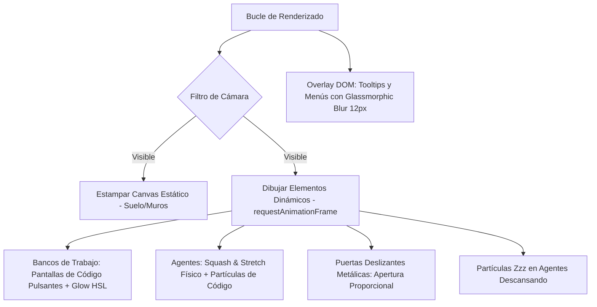

# Plan de Implementación: Embellecimiento Visual de Alta Fidelidad para Vista Local (RimWorld-Style) en RepoCiv

Este documento presenta una especificación técnica de nivel de ingeniería para la premiumización de la **vista local de repositorios** de RepoCiv. Se fundamenta en los estándares de diseño industrial y el ethos de **gstack** (`\\wsl.localhost\Ubuntu\home\gris\.hermes\workspace\repos\gstack`), en investigaciones de optimización gráfica en HTML5 Canvas 2D y en los principios de animación de personajes aplicados a interfaces de desarrollo de software.

---

## 🏛️ 1. Fundamentos Científicos y del Sistema de Diseño (gstack)

Para que esta mejora visual se considere **completa e impecable (Boil the Lake)**, alineamos la propuesta con la identidad de gstack y optimizaciones de bajo nivel para Canvas 2D:

### A. Lenguaje Estético de gstack (Industrial/Utilitarian)
*   **Colorimetría Restringida**: El marco visual (chrome) del mapa local utilizará grises zinc oscuros (`#0C0C0C` de base y `#141414` de superficie) con un uso altamente intencional y escaso de acentos **ámbar cálido** (en HSL `hsl(38, 92%, 50%)` / `#F59E0B`), emulando el cursor de una terminal analógica.
*   **Tipografía de Datos Monospaciada**: Para los nombres de archivos y números dentro del panel local, utilizaremos **JetBrains Mono** como tipografía de personalidad destacada, garantizando legibilidad en datos de alta densidad.
*   **Textura de Materialidad (Grain Texture)**: Implementaremos un overlay de ruido analógico muy tenue sobre la pantalla mediante un filtro SVG de turbulencia (`feTurbulence`) en el DOM con opacidad del `3%` en modo oscuro, eliminando la sensación "plana y genérica" del lienzo digital.

### B. Rendimiento Gráfico en Canvas 2D (Partial Redraw & State Batching)
Según las mejores prácticas de rendimiento de motores de juegos 2D en navegadores:
*   **State Batching (Agrupación de Estados)**: Evitaremos la reasignación constante de propiedades costosas del contexto (`ctx.fillStyle`, `ctx.strokeStyle`, `ctx.font`). El renderizador agrupará las baldosas por tipo para ejecutar una sola llamada a `stroke()` o `fill()` por lote, lo que reduce drásticamente las llamadas a la API de la GPU.
*   **Offscreen Canvas Buffering (Doble Búfer)**: Las capas estáticas del repositorio (el plano de muros, las baldosas metálicas del suelo y los límites de las habitaciones) se dibujarán una sola vez en un canvas oculto en memoria. Durante el ciclo dinámico de animación (`requestAnimationFrame`), este canvas estático se estampará instantáneamente en el canvas principal usando `drawImage()`.
*   **Culling por Cámara**: Solo se procesarán y dibujarán aquellos elementos que caigan dentro del marco visible de la cámara (`cam.x`, `cam.y` y el factor de `zoom`), optimizando el rendimiento en repositorios de gran envergadura.

---

## 🎨 2. Especificación Técnica de las Mejoras Visuales



### A. Texturizado del Suelo (Placas de Acero y Remaches)
Para lograr la estética industrial y utilitaria de gstack:
*   **Detalle de Placas**: El fondo del suelo se rellenará con un gris profundo `hsl(240, 10%, 15%)`. Cada baldosa dibujará una cuadrícula interna delgada de 1px `rgba(255, 255, 255, 0.015)` y cuatro micro-remaches de 1px en los vértices interiores en color gris oscuro.
*   **Zonas de Deuda Técnica (Debris Overlay)**: Los escombros de deuda técnica se dibujarán como grietas geométricas de oclusión angular en lugar de líneas aleatorias, utilizando trazos segmentados en `rgba(239, 68, 68, 0.15)` (rojo error) para sugerir código fracturado.

### B. Muros con Biselado Dorado e Iluminación de Oclusión
*   **Efecto Bisel (3/4 Perspective)**: Los muros tendrán un núcleo gris zinc (`#18181B`) y un contorno superior dorado ámbar (`#c8a84b` / `hsl(38, 92%, 50%)`).
*   **Sombra de Oclusión**: Usando `ctx.createLinearGradient`, proyectaremos un degradado suave de sombra de 4 píxeles desde el borde inferior de cada muro hacia el suelo adyacente, dotando a la cuadrícula de profundidad RimWorld instantánea.

### C. Puertas de Seguridad Deslizantes (Sliding Security Gates)
*   **Animación Física**: La puerta cambiará de un estado estático a una animación fluida de paneles que se separan lateralmente.
*   **Fórmula**: Calcularemos la cercanía de la unidad más rápida hacia cada baldosa de puerta:
    $$\text{distancia} = \sqrt{(x_{\text{unit}} - x_{\text{door}})^2 + (y_{\text{unit}} - y_{\text{door}})^2}$$
    Si la distancia es menor a $1.8$ casillas, el factor de apertura se interpolará linealmente con delta time:
    $$\text{openPct} = \max(0, \min(1, (1.8 - \text{distancia}) \times 1.5))$$
    La puerta dibujará dos hojas metálicas que se desplazarán hacia afuera en un ancho proporcional a $\text{openPct}$.

### D. Bancos de Trabajo con Terminales Pulsantes y Glow Activo
*   **Glow Neon de Ficheros**: Para los escritorios con tareas activas, se utilizará una sombra nativa de Canvas para crear resplandor:
    ```typescript
    ctx.save();
    ctx.shadowColor = extColor;
    ctx.shadowBlur = 12 * Math.sin(performance.now() / 150) + 16; // Aura pulsante
    ctx.fillStyle = extColor;
    ctx.fillRect(px + 4, py + 4, s - 8, s - 14); // Pantalla de la terminal
    ctx.restore();
    ```
*   **Líneas de Código**: En la pantalla de la terminal, dibujaremos 3 líneas horizontales diminutas que simularán el progreso del scroll de código usando un desfase por tiempo.

### E. Micro-Animaciones de Agentes (Squash & Stretch con Volumen Constante)
Para evitar que las unidades parezcan círculos de plástico rígido, aplicaremos el principio clásico de conservación de volumen en animación:
*   **Matemática de Squash & Stretch**: Si el agente se mueve con velocidad lineal, se estirará en el eje de movimiento y se aplastará en el eje perpendicular, manteniendo la masa constante:
    $$V = W \times H = \text{constante}$$
    Si estiramos el agente multiplicando su dimensión en la dirección del movimiento por un factor $S_f = 1 + (\text{velocidad} \times 0.2)$, entonces comprimiremos el eje perpendicular por:
    $$S_c = \frac{1}{S_f}$$
*   **Balanceo de Paso (Walking Bobbing)**: Añadiremos un desplazamiento vertical armónico simple a la coordenada Y del agente únicamente durante el estado de movimiento:
    $$y_{\text{offset}} = \sin(\text{pathProgress} \times \pi \times 2) \times 2.5 \text{ px}$$
*   **Visores LED Dinámicos**: Los agentes tendrán dos luces circulares diminutas en su borde delantero en dirección a su objetivo que parpadearán ligeramente cuando estén codificando.

### F. Sistemas de Partículas Ultra-Ligeros (Partículas de Código y Sueño)
Un emisor de partículas simple incorporado al renderizador gestionará la creación de pequeños elementos con delta time:
1.  **Código Flotante (Sparks)**: Partículas verdes o del color de la extensión (`.ts` azul, `.py` cyan) saldrán despedidas sutilmente del banco de trabajo con un movimiento ondulatorio aleatorio en el eje X:
    $$x = x_0 + \sin(\text{life} \times 8) \times 3$$
2.  **Zzz de Descanso**: Cuando el agente esté en la Rest Area o en el Kiosko de CDaily, flotarán letras "Z" con fuentes pequeñas monospaciadas en un tono ámbar tenue.

---

## 💻 3. Estilo de Interfaz Flotante (Glassmorphic DOM de gstack)

Los componentes `.lt-tooltip`, `.lt-menu`, `.lt-preview` y `.lt-git-panel` se rediseñarán bajo las pautas del sistema de diseño industrial de gstack para dotar a la UI de un aspecto de consola de control premium:

```css
/* Glassmorphism Ultra-Premium Industrial */
.lt-tooltip,
.lt-menu,
.lt-preview,
.lt-git-panel {
  background: rgba(12, 12, 12, 0.78) !important;
  backdrop-filter: blur(16px) saturate(180%) !important;
  -webkit-backdrop-filter: blur(16px) saturate(180%) !important;
  border: 1px solid rgba(245, 158, 11, 0.35) !important; /* Ámbar de gstack traslúcido */
  border-radius: 6px;
  box-shadow: 0 12px 40px rgba(0, 0, 0, 0.75), inset 0 1px 0 rgba(255, 255, 255, 0.05);
  font-family: 'JetBrains Mono', var(--font-mono), monospace;
  font-size: 11px;
  letter-spacing: -0.02em;
  color: #a1a1aa; /* Gris Zinc-400 de gstack */
  
  /* Entrada elástica premium */
  animation: ltElasticIn 0.22s cubic-bezier(0.175, 0.885, 0.32, 1.275) forwards;
}

@keyframes ltElasticIn {
  from {
    opacity: 0;
    transform: scale(0.9) translateY(6px);
  }
  to {
    opacity: 1;
    transform: scale(1) translateY(0);
  }
}

/* Efecto hover premium para menús de gstack */
.lt-item {
  color: #FAFAFA;
  transition: all 0.12s cubic-bezier(0.16, 1, 0.3, 1);
}
.lt-item:hover {
  background: rgba(245, 158, 11, 0.12) !important; /* Fondo ámbar sutil */
  border-left: 2px solid #F59E0B; /* Indicador ámbar de cursor de terminal */
  padding-left: 8px; /* Micro-desplazamiento elástico */
}
```

Para aplicar el **grano de textura** analógico de gstack sobre el lienzo de juego, añadiremos un pseudo-elemento global al contenedor `#app`:

```css
#app::after {
  content: "";
  position: fixed;
  inset: 0;
  width: 100vw;
  height: 100vh;
  z-index: 9999;
  pointer-events: none;
  opacity: 0.03; /* Grano ultra sutil para modo oscuro */
  background-image: url("data:image/svg+xml,%3Csvg viewBox='0 0 200 200' xmlns='http://www.w3.org/2000/svg'%3E%3Cfilter id='noiseFilter'%3E%3CfeTurbulence type='fractalNoise' baseFrequency='0.8' numOctaves='3' stitchTiles='stitch'/%3E%3C/filter%3E%3Crect width='100%25' height='100%25' filter='url(%23noiseFilter)'/%3E%3C/svg%3E");
}
```

---

## 🛡️ 4. Plan de Verificación y Criterios de Satisfacción

Para asegurar que estos cambios mantengan el rendimiento impecable de RepoCiv:

### A. Verificación de Rendimiento (Límite de Consumo de GPU y CPU)
*   **Tasa de Refresco Mínima**: La vista local debe sostener **60 FPS** continuos en pantallas estándar (o 120 FPS en monitores de alta tasa de refresco) sin tirones visuales (*micro-stuttering*).
*   **Uso de Heap de JS**: La adición del sistema de partículas y el ciclo de squash/stretch no debe causar fugas de memoria (*memory leaks*). La típica sierra de memoria en Chrome DevTools debe mostrar una tendencia estable sin pendiente positiva ascendente.
*   **Batching Check**: Validar mediante el Profiler que el número de llamadas a `fillStyle`/`strokeStyle` se mantenga constante sin importar el tamaño del repositorio, gracias al agrupamiento por tipos de azulejos.

### B. Pruebas Funcionales e Interactivas de UI
*   **Transiciones sin Saltos**: Al hacer doble click en una ciudad, la transición de pantalla negra a la cuadrícula local de la sala principal debe completarse con un fundido suave de 300ms.
*   **Fidelidad de Partículas**: Verificar que al completar una tarea o al cancelarla, todas las partículas asociadas al agente se desvanezcan elegantemente de la pantalla (limpieza de memoria).
*   **Responsividad Móvil/Trackpad**: Probar que las operaciones de arrastre (Pan) y zoom (Pinch-to-zoom / Rueda) mantengan una respuesta elástica e inmediata en la vista local.
