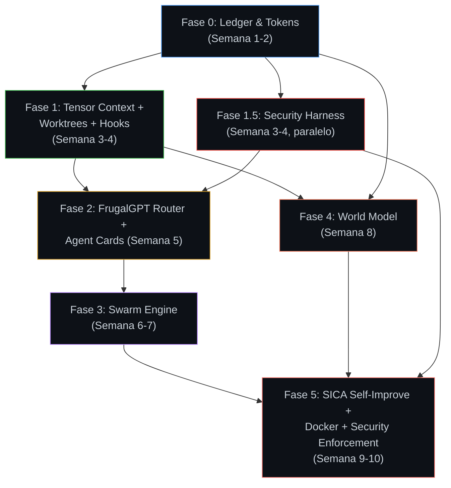

# Plan Maestro Definitivo: RepoCiv v2.0 — Agent OS Industrial (Post-Review)

**Fecha:** 2026-05-01 · **Revisión:** Incorpora 3 ajustes críticos de reseña DAVI + 6 repos adicionales + recalibración 10 semanas

---

## Estado Real al 2026-05-07

> **Este plan fue escrito cuando el trunk estaba roto.** Esta sección documenta el estado real actual para evitar deriva entre docs y código.

### Build / Tests
- `python3 -m pytest server/ -q` → **488 passed, 1 skipped** ✅
- `npm test` → **279 passed** ✅
- `npm run check` → **pasa completo** (tests + vite build) ✅
- `server/agent_runner.py` default model corregido a `hermes-agent` (era `minimax-m2.6`)

### Lo que YA existe (no sobredocumentar)
- `server/task_orchestrator.py` — ciclo por issue funcional
- `server/workspace_issue.py` — spec/plan/state/output + artifacts
- Checkpoints + resume + sentinel `.repociv/status`
- `server/step_executor.py` — separación SCOUT / WORKER / DAVI
- `server/model_router.py` — routing por rol (conceptual, no enforceado)
- `server/bridge.py` — endpoints tareas, métricas, eventos, harnesses, recovery
- Frontend: taskPanel, observabilityPanel, timelinePanel, approvalPanel, harnessPanel, recoveryPanel
- `shared/harness-registry.json` + `src/harnessRegistry.ts` + `server/harness_registry.py`
- Chat UI: resizable panel, message alignment, timestamps, scroll-to-bottom, history persistence
- Map: hex grid, fog of war, pathfinding A*, city placement, repo onboarding

### Lo que FALTA (deudas reales)
- `validation_contract` — no existe
- `validator role` — no existe como entidad independiente
- Behavioural validation en loop principal
- Handoff estructurado tipado
- Enforcement real de modelo por rol (model_router no se refleja en runtime)
- Mission Control semántico unificado (paneles fragmentados)

### Deudas cerradas
- ~~`npm run check` fallaba por TS~~ → ✅ resuelto (2026-05-07)
- ~~HERMES_MODEL default inválido~~ → ✅ resuelto (2026-05-07)
- ~~Bug drag unit a city tile~~ → ✅ resuelto (commit df70f6a)

---

## 0. Orígenes y Posicionamiento

### 0.1 RepoCiv vs AgentCraft — Parity Matrix

RepoCiv nació inspirado en [AgentCraft](https://getagentcraft.com) — el orquestador RTS de Ido Salomon. Tras auditar sus docs y features, este es el gap analysis honesto:

| Feature AgentCraft | RepoCiv Hoy | Gap | Acción v2.0 |
|---|---|---|---|
| **RTS Visual Map** (3D heroes on map) | ✅ Canvas 2D hex map con units, fog of war, pathfinding A* | Menor — AC tiene 3D pero RepoCiv tiene hex grid funcional | Mantener. El hex grid con pathfinding real es más profundo que la visualización 3D de AC |
| **Mission Tracking** (persist across restarts, AI summaries) | ✅ `workspace_issue.py` con spec/plan/state/output | Paridad | Mejorar con DuckDB Ledger |
| **Isolated Agent Containers** (Docker/Apple Containers) | ❌ No existe | **CRÍTICO** | **Fase 5: Docker isolation** |
| **Git Worktrees** (spawn heroes in worktrees) | ❌ Mencionado en plan original pero no implementado | **IMPORTANTE** | **Fase 1: operacionalizar** |
| **Skill Scrolls** (collectible skills from skills.sh) | ❌ No existe | Medio | Mapear a `directive_learner.py` skills |
| **Scheduled Tasks** (cron-like intervals) | ✅ `scheduler.py` con priority queue + fatigue | ✅ RepoCiv es **superior** aquí — tiene fatigue system XCOM | Mantener |
| **Remote Access / Mobile PWA** | ❌ Solo localhost | Medio | Fuera de scope v2.0 |
| **Agent Teams / Alliance Hall** | ❌ No existe | Bajo | Fuera de scope v2.0 |
| **Multi-Agent CLI support** (Claude Code, OpenCode, Cursor) | ✅ `runtime_adapters.py` con adapters múltiples | Paridad | Mantener |
| **Fog of War** | ✅ Implementado en renderer | Paridad | — |
| **Achievements / Race Skins** | ❌ No existe | Cosmético | Fuera de scope v2.0 |
| **Model Routing inteligente** | ✅ `model_router.py` (tabla estática) | AC **no tiene esto** — RepoCiv ya es superior | **Fase 2: hacerlo dinámico** |
| **Swarm Debate / Believability** | ❌ No existe | AC **no tiene esto** | **Fase 3: ventaja competitiva** |
| **Context Algebra / Tensor** | ❌ No existe | AC **no tiene esto** | **Fase 1: ventaja competitiva** |
| **Self-Improvement Loop** | ❌ No existe | AC **no tiene esto** | **Fase 5: ventaja competitiva** |

> [!IMPORTANT]
> RepoCiv ya supera a AgentCraft en: scheduling con fatigue, priority matrix, model routing, bridge auth, event store, y reconciliación de estado. Lo que le falta es **aislamiento Docker** y **worktrees**. Lo que lo haría **estrictamente superior** son las 6 capas nuevas que este plan introduce.

### 0.2 Fuentes SOTA Externas Incorporadas

| Paper / Proyecto | Año | Qué Aporta a RepoCiv |
|---|---|---|
| **SICA** (Robeyns et al., arxiv 2505) | 2025 | El agente edita su propio código para mejorar. RepoCiv puede auto-optimizar sus prompts y routing tables |
| **MemGPT / Letta** (Packer et al.) | 2023-2026 | OS-inspired context paging: Main Context (RAM) ↔ External Context (Disk). Modelo directo para `workspace_issue.py` |
| **Google A2A Protocol** | 2025 | Agent Cards (JSON metadata per agent), Task Lifecycle States (submitted→working→input-required→completed→failed) |
| **FrugalGPT** (Chen et al., arxiv) | 2023-2025 | Model Cascade: enviar primero al modelo barato, escalar solo si la confianza es baja. Ahorra 70-90% en tokens |
| **LangGraph Checkpoints** | 2025-2026 | Immutable state snapshots per super-step, time-travel debugging, PostgreSQL persistence |
| **Darwin Gödel Machine** (Sakana AI) | 2025 | Evolutionary archive of agents with Darwinian selection — complementa SICA |

### 0.3 Fuentes Internas (.hermes) — Inventario Final

| Fuente | Módulo | Qué se Porta |
|---|---|---|
| **ART** `research_ledger.py` | DuckDB con `hypotheses`, `agent_predictions`, `get_agent_believability()` | → `server/research_ledger.py` |
| **ART** `token_ledger.py` | Acumulador thread-safe de tokens + cost + `check_budget_violation()` | → `server/token_ledger.py` |
| **ART** `swarm.py` | `SpecialistAgent` + `ConsensusEngine` + weighted voting | → `server/swarm_engine.py` |
| **ART** `world_model.py` | Surrogate con k-NN + SLM Critic + UCB pruning + shadow→active | → `server/world_model.py` |
| **ART** `meta_optimizer.py` | ES antithetic + World Model gating | Patrón para self-improvement loop |
| **Financial-Lab** `swarm.py` | `success_memory` scaling weights by historical accuracy | Merge en `swarm_engine.py` |
| **Financial-Lab** `graph_policy.py` | GAT con Prior Knowledge Masking (adj matrix blocks invalid edges) | Patrón para `task_orchestrator.py` |
| **LexO** `tensor_umj.py` | Álgebra `suma/resta/interseccion/composicion/proyectar/budget_prune` | → `server/tensor_context.py` |
| **LexO** `VAULT_CONTRACT.md` | Metodología de ingesta en capas con invariantes canónicas | → `server/vault_contract.py` |
| **Homeostatic-Runtime** `policy.py` | Signal extraction (regex) + tier routing + health + budget gating | Absorbe en `server/model_router.py` |
| **Graph-Legal-IR** `AI_AGENT_SPRINT_PLAN.md` | Sprint Gates con acceptance criteria binarios | Metodología del plan |
| **Cybersecurity-Lab** `scanners/*` | 3-Layer Defense (Gate/Monitor/Enforce), YARA 35+ rules, IOC scanner, secrets detector, behavioral strace monitor | → `server/security_harness.py` |
| **Cybersecurity-Lab** `auto_escalation.py` | Quarantine atómica con path-traversal protection + alert system HMAC audit log | → `server/security_harness.py` |
| **Cybersecurity-Lab** `IMPROVEMENT_CYCLE.md` | Red-Blue Elliot/Mr.Robot adversarial loop: attack→defend→plan→fix→review | Patrón para security regression CI |
| **MoE-Homeostatico** `src/core/routing.py` | Greedy routing con stretch metrics + `evaluate_routing()` + `compare_routing()` pre/post transform | Complementa FrugalGPT cascade con MoE gating adaptativo |
| **turboquant-memory** `integration/davi_hook.py` | Compresión semántica de memoria episódica (342→38 líneas, 10x) con archival | Patrón para compresión de DCs en Archival Storage |
| **nemoclaw** `Dockerfile` + `agents/` | Delegación a NVIDIA NIM (Nemotron) + Docker isolation patterns (25KB Dockerfile) | Adapter NIM para cascade + Dockerfile.agent base |
| **L-kn-homeostatic-gateway** `src/` | Gateway HTTP FastAPI con entropy probe + mode selection (FLUIDO/ANALITICO) | Patrón completo para `bridge.py` scaling |
| **orchestrator-audit** `AUDIT_REPORT.md` | 543 líneas, 22 fuentes, 6 hallazgos profundos (A2O sentinel, hooks YAML, StrEnum, checkpoints, semantic truncation) | **Fuente primaria** — ver §2.6 |

---

## 0.4 Hallazgos de la Auditoría Previa Incorporados

Del `orchestrator-audit/AUDIT_REPORT.md` (543 líneas, 22 fuentes, 6 hallazgos profundos):

| Hallazgo | Fuente | Qué es | Dónde se integra |
|---|---|---|---|
| **H1. A2O Sentinel File** | Sortie | Archivo `.repociv/status` donde el agente escribe `blocked`/`done`/`needs-human-review`. Zero-dependency, fail-safe. Resuelve loops fix→fail→retry | **Fase 1**: `workspace_issue.py` crea `.repociv/status` en cada issue workspace |
| **H2. State Machine vía StrEnum** | Loom | Fases como `StrEnum` extensible en vez de strings hardcoded. Permite agregar `SECURITY_HARDENING` sin romper el orquestador | **Fase 0**: `server/phases.py` con `class Phase(StrEnum)` |
| **H4. Phase Checkpoints** | full-stack-orchestration | 3 checkpoints duros: post-diagnose, post-plan, post-fix. El agente NO avanza sin aprobación | **Fase 1**: integrar en `task_orchestrator.py` |
| **H5. Hooks YAML Declarativos** | Sortie | `repociv.yaml` en raíz de cada repo gestionado con hooks `on_issue_open`, `before_subagent`, `after_subagent`, `on_issue_close`. Variables de entorno inyectadas | **Fase 1**: `server/repociv_hooks.py` lee YAML, no hardcoded |
| **H6. Semantic Truncation** | agent-orchestration | Truncar contexto por relevancia semántica, no por longitud. Token budget dinámico por fase | **Fase 4**: integrar en World Model `prune_context()` |

> [!IMPORTANT]
> H1 (sentinel file) y H5 (hooks YAML) son los más accionables. Reemplazan git worktrees hardcoded y loops de retry sin control.

---

## 1. Tensor de Contexto — El Álgebra de Prompts

### 1.1 Concepto Central

En LexO, TensorUMJ opera sobre *Unidades Mínimas Jurídicas*. En RepoCiv, la unidad atómica es la **Directiva de Contexto (DC)** — un fragmento composicional que alimenta el prompt de un agente.

Esto implementa concretamente el paradigma **MemGPT/Letta**: el prompt activo del agente es "Main Context" (RAM limitada), y las DCs archivadas en DuckDB son "External Context" (disco). El `TensorContext` es el *memory manager* que decide qué páginas cargar/descargar.

```python
# server/tensor_context.py (NUEVO)
@dataclass
class ContextDirective:
    id: str                    # hash SHA-256[:16]
    text: str                  # contenido del fragmento
    metadata: dict             # {source, type, agent_affinity, freshness}
    deontic: str               # "must_include" | "should_include" | "exclude"

class TensorContext:
    """Motor de álgebra para Directivas de Contexto — el Memory Manager de RepoCiv."""

    # --- Fase 1 (MVP) ---
    def build_mission_prompt(self, base, plus, budget) -> str:  # Reemplaza concatenación
    def budget_prune(self, max_tokens) -> list[DC]:              # Podar por presupuesto
    def suma(self, a, b) -> list[DC]:                            # Unión deduplicada

    # --- Fase 3+ (cuando exista corpus de DCs reales) ---
    def resta(self, a, b) -> list[DC]:      # Exclusión (retirar errores conocidos)
    def interseccion(self, a, b) -> list[DC]: # Contexto compartido (handoff SCOUT→WORKER)
    def composicion(self, a, b) -> DC:      # Encadenar: "Analiza X" → "Implementa Y"
    def analizar_conflictos(self) -> list:   # Detectar DCs contradictorias
```

> [!NOTE]
> **Ajuste post-review:** Solo 3 operaciones en Fase 1 (build_mission_prompt, budget_prune, suma). Las 4 restantes se mueven a Fase 3+ cuando exista un corpus de DCs reales sobre el cual operar. Implementar álgebra completa sin datos es arquitectura especulativa.

### 1.2 Mapeo MemGPT ↔ RepoCiv

| Concepto MemGPT | Implementación RepoCiv |
|---|---|
| **Main Context (RAM)** | El prompt final construido por `build_step_mission()` — limitado por ventana del modelo |
| **Working Memory** | DCs con `deontic="must_include"`: spec, plan, system prompt |
| **Recall Storage** | Últimos N step artifacts en `workspace_issue.py/output/` — acceso frecuente |
| **Archival Storage** | DuckDB `context_directives` table — búsqueda semántica por embedding |
| **Self-Directed Paging** | `TensorContext.budget_prune()` decide qué cargar en Main Context |
| **Memory Blocks** | Cada DC es un memory block discreto, editable, con metadata |

---

## 2. Ledger Unificado — DuckDB como Cerebro

### 2.1 Reconciliación de Data Sources (Ajuste Crítico #2)

> [!WARNING]
> RepoCiv ya tiene 4 sistemas de persistencia: `event_store.py` (JSONL), `workspace_issue.py` (filesystem), `sessions.py` (JSONL transcripts), `run_state.py` (snapshots). Crear DuckDB sin definir coexistencia = divergencia garantizada.

**Entregable obligatorio de Fase 0:** `docs/DATA_SOURCES.md` que define:

| Store | Fuente de verdad para | Formato | Mutabilidad | Gana cuando diverge |
|---|---|---|---|---|
| `event_store.py` (JSONL) | Auditoría — log inmutable de todo lo que pasó | Append-only JSONL | Inmutable | **Siempre** (es el audit trail) |
| DuckDB Ledger (NUEVO) | Queries analíticas — believability, cost, latency | SQL tables | Derivada del Event Store | Nunca — se reconstruye desde JSONL |
| `workspace_issue.py` | Estado operacional por issue — spec, plan, artifacts | Filesystem (markdown) | Mutable | Para estado actual del issue |
| `sessions.py` + `run_state.py` | Sesiones activas + snapshots resumibles | JSONL + JSON | Volátil | Para recuperación de crash |

**Invariante:** DuckDB es una **vista materializada** del Event Store. Si se corrompe, `python -m server.rebuild_ledger` lo reconstruye desde los JSONL. Nunca al revés.

### 2.2 Esquema DuckDB

```sql
CREATE TABLE missions (
    id TEXT PRIMARY KEY, repo TEXT, issue_id TEXT, agent TEXT,
    model TEXT, step_idx INTEGER, phase TEXT,
    prompt_tokens INTEGER, completion_tokens INTEGER, cost_estimate REAL,
    duration_s REAL, outcome TEXT, error_summary TEXT,
    created_at TIMESTAMP DEFAULT CURRENT_TIMESTAMP
);
CREATE TABLE agent_predictions (
    id INTEGER PRIMARY KEY, mission_id TEXT REFERENCES missions(id),
    agent_name TEXT, predicted_outcome TEXT, confidence REAL,
    actual_outcome TEXT, is_correct BOOLEAN,
    created_at TIMESTAMP DEFAULT CURRENT_TIMESTAMP
);
```

### 2.2 Believability Engine (de ART `research_ledger.py`)

```python
def get_agent_believability(self) -> dict[str, float]:
    """WORKER que acierta 90% → 0.9. Uno que falla → 0.1 (nunca 0)."""
    rows = self.conn.execute("""
        SELECT agent_name, COUNT(*), SUM(CASE WHEN is_correct THEN 1 ELSE 0 END)
        FROM agent_predictions WHERE is_correct IS NOT NULL GROUP BY agent_name
    """).fetchall()
    return {name: max(0.1, correct/total) for name, total, correct in rows}
```

---

## 3. Model Router — FrugalGPT Cascade + Homeostatic Routing

### 3.1 FrugalGPT Cascade

El paper FrugalGPT propone un patrón que RepoCiv ya tiene en embrión con `retry_step()`:

```
Haiku → ¿Confianza alta? → DONE
         ¿Confianza baja? → Sonnet → ¿OK? → DONE
                                      ¿Falla? → Opus
```

Implementación concreta en el router refactorizado:

```python
# server/model_router.py (REFACTOR)

def route_model(agent_type, task_type, context=None) -> dict:
    # 1. Signal extraction (de homeostatic-runtime)
    signals = extract_signals(context.get("mission_text", ""))

    # 2. Budget gating (FrugalGPT rule #1)
    if token_ledger.get_budget_used_pct() > 80:
        return force_tier("FLUIDO")  # siempre haiku si budget bajo

    # 3. System health check (de homeostatic-runtime)
    if check_system_health()["system_overloaded"]:
        return downgrade_tier(base_tier)

    # 4. Believability-adjusted (de ART research_ledger)
    score = ledger.get_agent_believability().get(agent_type, 1.0)
    if score < 0.4:
        return escalate_tier(base_tier)  # agente malo → modelo mejor

    # 5. FrugalGPT Cascade: empezar barato, escalar si falla
    return {"model": cheapest_viable(signals), "cascade": True,
            "fallback_chain": ["haiku", "sonnet", "opus"]}
```

### 3.2 A2A Agent Cards

Cada tipo de agente en RepoCiv tendrá un Agent Card (JSON) conforme al protocolo A2A de Google:

```json
{
  "name": "WORKER",
  "description": "Executor sin memoria. Recibe una tarea, la resuelve en mínimo tokens.",
  "capabilities": ["edit_file", "create_file", "run_tests", "refactor"],
  "modalities": ["text"],
  "authentication": {"type": "bearer", "header": "X-RepoCiv-Token"},
  "endpoint": "http://localhost:5274/api/dispatch",
  "task_lifecycle": ["submitted", "working", "completed", "failed"],
  "model_affinity": "claude-sonnet-4-5",
  "believability": 0.85
}
```

Estos cards se almacenan en `server/agent_cards/` y son consumidos por el router, el scheduler, y el frontend para renderizar tooltips de capacidad.

---

## 4. Swarm Engine — Debate Multi-Agente

### 4.1 Portado de ART `swarm.py` + Financial-Lab success_memory

```python
# server/swarm_engine.py (NUEVO)
class ConsensusEngine:
    def _calculate_weighted_vote(self, signals):
        for signal in signals:
            # Peso = believability (del Ledger) × confianza del agente
            weight = self.ledger.get_agent_believability().get(signal.agent_name, 1.0)
            weight *= signal.confidence
            # ... acumulación ponderada
    
    async def debate(self, hypothesis, regime) -> SwarmDebateResult:
        # Debate concurrente entre CodeReview, Security, Architecture agents
        signals = await asyncio.gather(*[agent.analyze(hypothesis) for agent in self.agents])
        vote = self._calculate_weighted_vote(signals)
        decision = "PROCEED" if vote["normalized"] > 0.2 else "DISCARD"
        return SwarmDebateResult(consensus_decision=decision, ...)
```

### 4.2 Condiciones de activación

- `task_type == "edit"` y priority ≥ HIGH
- WORKER ha fallado ≥1 vez en este issue (circuit breaker activo)
- Mission toca archivos en `server/` (código crítico)

---

## 5. World Model — Filtrado de Contexto Pre-LLM

### 5.1 Concepto

En ART el World Model predice fitness de prompt variants. En RepoCiv, predice la **utilidad de incluir una DC en el prompt**:

```python
# server/world_model.py (NUEVO)
class ContextWorldModel:
    def predict(self, dc, mission, regime) -> FitnessPrediction:
        ledger_score = self._knn_predict(dc.embedding)   # k-NN sobre DCs exitosas
        freshness = max(0, 1.0 - hours_since(dc) / 48)   # decay temporal
        redundancy = self._cosine_similarity(dc, selected) # penalizar duplicados
        return FitnessPrediction(fitness_hat=ledger_score * freshness - redundancy)

    def prune_context(self, all_dcs, budget) -> list[DC]:
        # UCB selection: fitness_hat + β·uncertainty
        # must_include siempre pasan
```

### 5.2 Shadow → Active Promotion (de ART)

Arranca sin podar (shadow). Tras N ciclos, si Spearman ρ ≥ 0.6 y top-k recall ≥ 0.7, promueve a `active`. Si no cumple → se desactiva con artifact de documentación.

---

## 6. Security Harness — Defensa en Profundidad para el Agent OS

> [!WARNING]
> RepoCiv ejecuta código generado por LLMs en el filesystem del usuario. Sin una capa de seguridad, un agente comprometido o un prompt injection podría exfiltrar secrets, modificar repos protegidos, o instalar backdoors. El `cybersecurity-lab` ya tiene las herramientas para resolver esto — solo hay que integrarlas.

### 6.1 El Modelo de 3 Capas (de `cybersecurity-lab/STRATEGY.md`)

El lab implementa un modelo de defensa en profundidad que se mapea perfectamente al ciclo de vida de un mission en RepoCiv:

| Capa | Cuándo | Qué hace en cybersecurity-lab | Qué hace en RepoCiv |
|---|---|---|---|
| **Capa 1: Pre-ejecución (Gate)** | Antes de despachar un command al agente | YARA scan + skill_scanner (28+ reglas) + IOC check + secrets detector | Escanear el `mission_text` y los artifacts de entrada buscando prompt injection, secrets expuestos, o payloads sospechosos |
| **Capa 2: Post-ejecución (Monitor)** | Después de que el agente entrega output | Drift detection (`check_drift.py`) + behavioral monitor (strace syscalls) | Verificar que los archivos modificados no introducen secrets, binarios, o conexiones externas no autorizadas |
| **Capa 3: Runtime (Enforcement)** | Durante la ejecución del agente | Network monitor + process sandboxing + auto-escalation con quarantine | Sandboxear al agente en Docker container (Fase 5) con network isolation, y activar quarantine automática si se detecta comportamiento anómalo |

### 6.2 Componentes Transportables

```python
# server/security_harness.py (NUEVO)

class SecurityHarness:
    """Capa de seguridad transversal para RepoCiv.
    Portado de cybersecurity-lab/scanners/."""

    def pre_dispatch_gate(self, mission_text: str, artifacts: list[str]) -> GateResult:
        """Capa 1: Escanea el input antes de enviarlo al agente."""
        # 1. Secrets detection (de scanners/secrets_detector.py — 15 patrones)
        secrets = self.secrets_detector.scan(mission_text)
        # 2. Prompt injection detection (reglas YARA adaptadas)
        injections = self.yara_scanner.scan_text(mission_text)
        # 3. IOC check — ¿el mission text referencia dominios/IPs maliciosos?
        iocs = self.ioc_scanner.check(mission_text)
        
        if secrets or injections or iocs:
            return GateResult(blocked=True, reason=..., evidence=...)
        return GateResult(blocked=False)

    def post_execution_audit(self, repo: str, changed_files: list[str]) -> AuditResult:
        """Capa 2: Verifica los cambios del agente después de ejecutar."""
        # 1. Drift detection — ¿el agente modificó archivos fuera de scope?
        drift = self.drift_checker.check(repo, changed_files)
        # 2. Secrets in output — ¿el agente dejó API keys en el código?
        secrets = self.secrets_detector.scan_files(changed_files)
        # 3. Behavioral analysis — ¿se detectaron syscalls sospechosos?
        behavior = self.behavioral_monitor.analyze_recent_strace()
        
        return AuditResult(clean=not(drift or secrets or behavior), ...)

    def runtime_enforce(self, agent_pid: int) -> None:
        """Capa 3: Monitoreo en tiempo real durante ejecución."""
        # 1. Network monitor (de scanners/network_monitor.py)
        #    - Detectar conexiones a dominios no whitelisted
        # 2. Auto-escalation (de scanners/auto_escalation.py)
        #    - Quarantine atómica con path-traversal protection
        # 3. Alert system (de scanners/alert_system.py)
        #    - Dedup temporal (30min window) + HMAC audit log
```

### 6.3 El Ciclo Adversarial Red-Blue (de `IMPROVEMENT_CYCLE.md`)

El lab ya tiene un loop de auto-mejora de seguridad que podemos reutilizar:

```
Mr. Robot (ataque) → genera muestra adversarial sintética
     ↓
Elliot (defensa) → ejecuta scanners contra la muestra
     ↓
¿Detectado? → SÍ → registrar como cobertura confirmada
             → NO → registrar como GAP → generar plan de mejora
     ↓
Implementar fix → replay ataque → verificar que el gap se cerró
```

En RepoCiv, esto se traduce en: periódicamente generar missions adversariales sintéticas (ej. "mission que intenta leer .env", "mission que intenta curl a dominio externo") y verificar que el SecurityHarness las bloquea. Los gaps se registran en el Ledger.

### 6.4 Incident Response Protocol (de `INCIDENT_RESPONSE.md`)

| Nivel | Condición | Acción RepoCiv |
|---|---|---|
| **L0 — Clean** | Todos los scans pasan | Operación normal |
| **L1 — Suspicious** | 1 scanner detecta algo | Crear reporte, alertar localmente, **no pausar** |
| **L2 — High Risk** | Múltiples scanners + secrets exposure | Pausar dispatch, preservar evidencia, notificar usuario |
| **L3 — Last Resort** | Exfiltración confirmada + drift en repos protegidos | **Kill switch**: detener todos los agentes, quarantine de artifacts, audit log HMAC |

### 6.5 Integración con Docker Isolation (Fase 5)

Cuando un agente ejecuta en Docker container:
- **Network**: `--network none` por defecto. Solo se habilita para SCOUT si necesita leer docs.
- **Filesystem**: bind-mount read-only del repo target. Write solo en `/tmp/workspace`.
- **Secrets**: NO se montan `.env`, `~/.ssh`, ni tokens del host. El agente recibe solo `X-RepoCiv-Token` vía env var.
- **Post-exec**: el output del container se escanea con `post_execution_audit()` antes de aplicar al repo real.

---

## 7. SICA Loop — Self-Improvement Engine

### 7.1 Concepto

El paper SICA (Robeyns 2025, arxiv 2505) demostró que un agente que edita su propio código puede mejorar de 17% a 53% en SWE-Bench. RepoCiv puede aplicar esto a sus propias routing tables, prompt templates, scoring weights, y **reglas de seguridad** (YARA rules, IOC lists, whitelist de dominios):

```python
# server/self_improve.py (NUEVO — Fase 5)
class SelfImprovementEngine:
    """El agente analiza su propio rendimiento y propone mejoras."""

    def reflect(self):
        """Lee el Ledger y detecta patrones de fallo sistemático."""
        stats = self.ledger.get_agent_believability()
        latency = self.metrics.get_step_latency_stats()
        # Detectar: "WORKER falla 60% en tasks de CSS" → proponer cambio

    def propose_improvement(self, pattern) -> Improvement:
        """Genera una propuesta de cambio concreta."""
        # Ejemplo: "Cambiar WORKER system prompt para CSS tasks"
        # Ejemplo: "Subir weight de ageWeight en priority matrix de 0.3 a 0.5"
        # Ejemplo: "Agregar keyword 'styles' a WORKER_KEYWORDS en step_executor"

    def validate_in_sandbox(self, improvement) -> bool:
        """Ejecuta tests con el cambio propuesto en un workspace temporal."""
        # git worktree add /tmp/repociv-sandbox-{hash}
        # aplicar cambio, pytest, verificar que no rompe

    def apply_if_approved(self, improvement):
        """Si pasa sandbox + aprobación del usuario → aplica."""
```

### 7.2 Qué puede auto-mejorar (scope controlado)

| Target | Mecanismo | Riesgo |
|---|---|---|
| Prompt templates en `agent_runner.py` | Reescribir system prompts | Bajo — sandboxed |
| Keywords en `step_executor.py` | Agregar/remover keywords | Bajo |
| Weights en `scheduler.py` | Ajustar `_WEIGHTS` dict | Medio — requiere test |
| Routing table en `model_router.py` | Cambiar asignaciones model↔agent | Medio |
| YARA rules en `security_harness.py` | Agregar nuevas reglas de detección | Bajo — solo suma defensas |
| IOC lists / domain whitelists | Actualizar listas de indicadores | Bajo |
| **Código estructural** | **NUNCA** — fuera de scope | — |

> [!CAUTION]
> El SICA loop **nunca** modifica código estructural (bridge.py, event_store.py, task_orchestrator.py). Solo toca configuración, prompts, y pesos numéricos. Todo cambio pasa por sandbox + aprobación humana.

---

## 8. Hoja de Ruta por Fases (con Acceptance Gates)



---

### Fase 0: Ledger & Token Tracking (Semanas 1-2)

**Crear:**
- `docs/DATA_SOURCES.md` — Definición estricta de fuentes de verdad y reconciliación (H2)
- `server/token_ledger.py` — port de ART, adaptado a modelos RepoCiv
- `server/research_ledger.py` — DuckDB con esquema §2.1
- `server/phases.py` — Implementar `class Phase(StrEnum)` para state machine extensible (H2)

**Modificar:**
- `server/agent_runner.py` — inyectar `token_ledger.log_usage()` en cada call
- `server/metrics.py` — endpoint `/metrics/token_budget`
- `server/event_store.py` — dual-write JSONL + DuckDB

**Gate F0:**
- [x] `DATA_SOURCES.md` aprobado y commiteado
- [x] Módulo `phases.py` usa `StrEnum` en todo el core
- [x] `check_budget_violation(limit)` funciona con test
- [x] `record_cycle()` persiste en DuckDB y sobrevive restart
- [x] `get_agent_believability()` devuelve `1.0` para agentes sin historial (caso base)
- [x] Dual-write verificado: JSONL y DuckDB contienen mismos eventos
- [x] `pytest server/` — 395 passed, 2 skipped (2026-05-01)

---

### Fase 1: Tensor Context + Worktrees + Hooks (Semanas 3-4)

**Crear:**
- `server/tensor_context.py` — `ContextDirective` + `TensorContext` engine (MVP scope)
- `server/tensor_context_test.py`
- `server/repociv_hooks.py` — Parsea `repociv.yaml` en repositorios (H5)

**Modificar:**
- `server/step_executor.py::build_step_mission()` — usar `TensorContext.build_mission_prompt()`
- `server/context_pack.py` — emitir `list[ContextDirective]`
- `server/workspace_issue.py` — operacionalizar git worktrees vía hooks YAML declarativos (H5)
- `server/workspace_issue.py` — crear y leer `.repociv/status` (A2O Sentinel File, H1)
- `server/task_orchestrator.py` — requerir Phase Checkpoints (H4)

**Gate F1:**
- [x] `repociv.yaml` controla creación/destrucción de worktrees vía hooks
- [x] Orquestador pausa ejecución leyendo `.repociv/status` (`blocked` / `needs-human-review`)
- [x] Checkpoints post-diagnose, post-plan, post-fix impiden progreso autónomo indeseado
- [x] `suma()` deduplica DCs por hash
- [x] `budget_prune()` respeta must_include y corta por límite
- [x] Git worktree cleanup sobrevive a crash del orquestador

---

### Fase 2: FrugalGPT Router + Agent Cards (Semana 5)

**Crear:**
- `server/signal_extractor.py` — port de homeostatic-runtime regexes
- `server/agent_cards/` — JSON Agent Cards por tipo (A2A format)

**Modificar:**
- `server/model_router.py` — tabla estática → cascade dinámico (§3.1)
- `server/scheduler.py` — `_priority_score()` consulta believability
- `server/step_executor.py` — retry_step usa cascade

**Gate F2:**
- [x] Router devuelve ECONOMICO cuando budget > 80%
- [x] Cascade haiku→sonnet funciona en test
- [x] Agent Cards JSON válidos para DAVI, WORKER, SCOUT, LEXO, OPENCLAW
- [x] `test_model_router.py` actualizado y pasa — 53/53 tests

---

### Fase 1.5: Security Harness (Semanas 3-4, paralelo)

> [!NOTE]
> **Nota sobre paralelismo:** Esta fase ocurre en las mismas semanas que la Fase 1. En un setup de 1 desarrollador, esto implica *context-switching* (avanzar en ambas dentro del mismo sprint), no trabajo concurrente puro.

**Crear:**
- `server/security_harness.py` — `SecurityHarness` con pre_dispatch_gate + post_execution_audit + runtime_enforce
- `server/security_rules/` — YARA rules adaptadas de cybersecurity-lab para contexto de agent missions
- `server/security_harness_test.py` — tests con missions adversariales sintéticas

**Portar de cybersecurity-lab:**
- `scanners/secrets_detector.py` → adaptado a escanear mission text + agent output
- `scanners/behavioral_monitor.py` → strace patterns para detectar exfiltración
- `scanners/auto_escalation.py` → quarantine atómica con path-traversal guard
- `scanners/alert_system.py` → dedup temporal + HMAC audit log

**Modificar:**
- `server/step_executor.py::dispatch_plan_step()` — wrappear con `security_harness.pre_dispatch_gate()` antes de dispatch y `post_execution_audit()` después
- `server/agent_runner.py` — inyectar `runtime_enforce()` como monitor del proceso del agente

**Gate F1.5:**
- [x] `pre_dispatch_gate()` bloquea mission text que contiene API keys hardcoded
- [x] `pre_dispatch_gate()` bloquea mission text con prompt injection patterns
- [x] `post_execution_audit()` detecta secrets en archivos modificados
- [x] `post_execution_audit()` detecta drift
- [x] Quarantine atómica mueve archivo a `quarantine/` sin path traversal
- [x] Alert system registra con dedup 30m y HMAC
- [x] 5 missions adversariales bloqueadas en tests (3 requeridas, 5 implementadas)
- [x] `pytest server/` — 440 passed, 2 skipped (2026-05-01)

---

### Fase 2: FrugalGPT Router + Agent Cards (Semana 5)

---

### Fase 3: Swarm Engine (Semanas 6-7)

**Crear:**
- `server/swarm_engine.py` — ConsensusEngine + 3 specialist agents
- `server/swarm_schemas.py` — Pydantic (AgentSignal, SwarmDebateResult)

**Modificar:**
- `server/task_orchestrator.py` — post-WORKER invoca swarm si conditions §4.2
- `server/research_ledger.py` — registra agent_predictions del swarm

**Gate F3:**
- [x] ConsensusEngine agrega 3 signals → PROCEED/DISCARD
- [x] Believability se actualiza tras cada debate
- [x] Swarm NO se activa en tasks de baja prioridad (performance check)
- [x] Output del swarm se persiste como DC
- [x] `pytest server/` — 461 passed, 1 skipped (2026-05-01)

---

### Fase 4: World Model (Semana 8)

**Crear:**
- `server/world_model.py` — ContextWorldModel con shadow→active
- `server/world_model_test.py`

**Modificar:**
- `server/tensor_context.py` — `budget_prune()` delega al WorldModel en modo active
- `server/research_ledger.py` — tablas world_model_predictions/history

**Gate F4:**
- [x] Shadow mode registra sin podar
- [x] Promotion automática con Spearman ρ ≥ 0.6, recall ≥ 0.7
- [x] Active mode reduce tokens ≥ 30% sobre baseline
- [x] Archival compression integrada: DCs viejas comprimidas vía patrón `turboquant-memory`
- [x] Calibration failure genera artifact documentado

---

### Fase 5: SICA Self-Improve + Docker + Security Enforcement (Semanas 9-10)

**Crear:**
- `server/self_improve.py` — SelfImprovementEngine (§7)
- `server/container_runtime.py` — Docker isolation para agents con security enforcement
- `Dockerfile.agent` — imagen base para agentes aislados (`--network none`, read-only bind mounts, sin secrets del host)

**Modificar:**
- `server/runtime_adapters.py` — agregar DockerAdapter
- `server/agent_runner.py` — opción de ejecutar en container, wrapeado con `security_harness.runtime_enforce()`
- `server/security_harness.py` — integrar con container lifecycle (pre-launch gate, post-exit audit)

**Gate F5:**
- [x] SICA `reflect()` detecta al menos 1 patrón de mejora en Ledger fixture
- [x] `propose_improvement()` genera propuesta válida
- [x] `validate_in_sandbox()` ejecuta pytest en worktree temporal
- [x] Container Docker se levanta con `--network none` y bind-mount read-only
- [x] Container NO tiene acceso a `.env`, `~/.ssh`, ni tokens del host
- [x] Output del container es escaneado por `post_execution_audit()` antes de aplicar
- [x] Red-Blue cycle: mission adversarial sintética es bloqueada en container
- [x] **Ningún cambio se aplica sin aprobación del usuario**

---

## 9. Métricas de Éxito Global

| Métrica | Baseline (hoy) | Target v2.0 | Medido por |
|---|---|---|---|
| Token cost por mission | Sin tracking | -40% vs baseline | `token_ledger.py` |
| Success rate por mission | Sin tracking | ≥ 75% | `research_ledger.py` |
| p95 step latency | ~sin datos | No +20% vs baseline | `metrics.py` |
| Context relevance | Sin medición | Spearman ρ ≥ 0.6 (world model) | `world_model.py` |
| Self-improvement proposals | 0 | ≥ 3 por semana de operación | `self_improve.py` |
| Docker isolation | 0% tasks aisladas | 100% WORKER tasks en container | `container_runtime.py` |
| **Security gate blocks** | 0 (no existe) | 100% missions pasan pre-dispatch scan | `security_harness.py` |
| **Secrets in output** | Sin detección | 0 secrets en agent output (post-audit) | `security_harness.py` |
| **Adversarial coverage** | 0 escenarios | ≥ 10 missions adversariales en regression suite | `security_harness_test.py` |

---

## 10. Lo que NO se hace en v2.0

Para mantener el scope controlado:
- ❌ Remote access / mobile PWA (feature de AC que requiere infra adicional)
- ❌ Alliance Hall / multiplayer (requiere networking)
- ❌ Race skins / achievements (cosmético, no aporta al Agent OS)
- ❌ Voice input (requiere TTS infra)
- ❌ Migración del frontend de Canvas 2D a 3D (el hex grid es superior para ops)
- ❌ Full autonomous agent escalation (Level 3 de INCIDENT_RESPONSE.md — requiere mucha más validación)

Estos quedan para un v3.0 si el usuario lo requiere.
